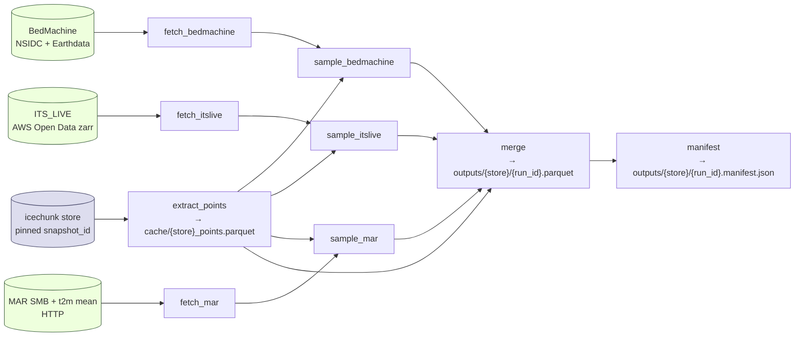

# Architecture: `radar-return-statistics-postprocessing`

## Context

`radar_return_statistics` writes per-trace radar metrics to versioned icechunk zarr
stores on S3 (`opr-radar-metrics/icechunk/{ase,greenland,utig}`). The store holds
per-trace lat/lon, time, frame_id, layer picks, powers, noise estimates, and a QC
mask, indexed by `slow_time`. (See `docs/data_access.md` and
`src/radar_return_statistics/store.py` in `radar-return-statistics`.)

The next step is a separate, reproducible pipeline that joins external gridded
products (BedMachine, ITS_LIVE, MAR) onto each trace and writes one geoparquet per
store. Goals: easy to understand, easy to reproduce, runnable as a GitHub Action.

This document is the architecture; an implementer will build the new repo from it.

## Decisions taken (vs. the original draft)

- **Repo**: `radar-return-statistics-postprocessing`, a *new* repo sibling to
  `radar-return-statistics`. Keeps producer/consumer separation, isolates heavy
  geospatial deps, pins against immutable icechunk snapshots.
- **Orchestration**: Snakemake (per-rule cache invalidation, free parallel fetch
  on Actions, `snakemake --report` for provenance HTML).
- **CLI & config**: `click` + plain-dict YAML with `setdefault`, **matching the
  upstream project's style** (`src/radar_return_statistics/{__main__,config}.py`).
  No `typer`, no `pydantic`. The config hash is a sha256 over canonical
  `json.dumps(config, sort_keys=True)`.
- **Datasets in scope for v1**: **BedMachine** (sanity check against radar
  `bed_elevation`), **ITS_LIVE** (surface velocity), and **MAR** (SMB + 2m air
  temperature long-term mean). No standalone ERA5; t2m is sourced from MAR's
  time-averaged climatology so we avoid a second auth surface (CDS API). Each
  trace still gets a spatially-resolved scalar; only the temporal dimension is
  collapsed.

## Pipeline shape



Every node is one Snakemake rule. Per-dataset selection comes from the YAML
config; Snakemake reads the config at parse time and only wires the plugins the
config lists, so an Antarctic-only run never builds a Greenland-MAR sample rule.

## Repo layout

```
radar-return-statistics-postprocessing/
  pyproject.toml              # uv-managed
  README.md
  CLAUDE.md
  Snakefile                   # top-level orchestration
  config/
    ase.yaml
    greenland.yaml
    utig.yaml
  src/radar_postproc/
    __init__.py
    __main__.py               # click CLI (run, list-datasets, validate-config)
    config.py                 # load_config() w/ setdefault defaults — same shape as upstream
    io_icechunk.py            # open at pinned snapshot → base points (gpd.GeoDataFrame)
    sampling.py               # CRS-aware point-in-raster sampler (shared by all plugins)
    provenance.py             # snapshot id, git sha, config hash, dataset checksums
    output.py                 # geoparquet writer + sidecar manifest + embedded file metadata
    datasets/
      __init__.py             # @register decorator builds name → class map
      base.py                 # Protocol
      bedmachine.py
      itslive.py
      mar.py                  # SMB + t2m mean (one plugin, two output columns)
  workflow/
    rules/
      fetch.smk
      sample.smk
      merge.smk
    scripts/                  # thin wrappers invoked by rules (call into src/)
  tests/
    unit/                     # plugin samplers vs synthetic rasters
    fixtures/                 # tiny CRS-tagged GeoTIFFs / netCDFs
  outputs/                    # gitignored
    cache/                    # pooch + earthaccess caches
    {store}/{run_id}.parquet
    {store}/{run_id}.manifest.json
  .github/workflows/
    ci.yml
    augment.yml
```

## Plugin interface (`datasets/base.py`)

A `Protocol` — duck-typed, no inheritance required. Each new dataset is one file:

```python
class ExternalDataset(Protocol):
    name: str                                # "bedmachine_v3_antarctic"
    version: str                             # pinned DOI / release tag
    variables: list[str]                     # parquet column names produced
    crs: str                                 # "EPSG:3031" | "EPSG:3413" | "EPSG:4326"
    valid_region: Literal["antarctic", "greenland", "global"]

    def fetch(self, cache_dir: Path) -> Path: ...
    def open(self, path: Path) -> xr.Dataset: ...               # rioxarray, CRS attached
    def sample(self, ds, points) -> dict[str, np.ndarray]: ...  # delegates to sampling.sample_raster
```

A `@register` decorator in `datasets/__init__.py` builds a name → class map; configs
reference plugins by name. Adding a dataset = one new file + one entry in the
per-store config.

`mar.py` returns two columns from a single fetched product
(`smb_mean_mm_we_yr`, `t2m_mean_K`), each pre-time-averaged over a configurable
period (default: 1980–2020 climatology). t2m is *not* time-resolved per trace —
it's a long-term mean sampled at the trace location, since downstream consumers
only need a climatic scalar.

## Tooling stack

- **Download**: `pooch` (checksums + idempotent cache) for ITS_LIVE / MAR;
  `earthaccess` for BedMachine (Earthdata auth). Wrapped behind each plugin's
  `fetch()`. No `cdsapi`.
- **Raster sampling**: `rioxarray` for CRS/affine, `xarray.interp` for bilinear
  continuous fields, `rasterio.sample` for nearest categorical (e.g. BedMachine
  `mask`). Single entry point `sampling.sample_raster(ds, points, method)`.
- **Output**: `geopandas.to_parquet` (geoparquet 1.1) so downstream consumers
  get a free spatial index.
- **Config**: plain `dict` from `yaml.safe_load` + `setdefault` defaults, mirroring
  `radar_return_statistics/config.py:load_config`. Canonical JSON dump for hashing.
- **CLI**: `click`, mirroring `radar_return_statistics/__main__.py`. Subcommands
  mostly shell out to `snakemake -s Snakefile --config ...`.
- **Icechunk input**: `icechunk` + `zarr` directly. Use the same `make_storage`
  pattern as `radar_return_statistics/store.py:19` (S3 or local backend selected by
  `store.backend`). Open at a *pinned snapshot ID* declared in the YAML — no
  `branch="main"` reads — so a re-run two months later produces the same output.

CRS handling lives entirely in `sampling.py`: every plugin reports its own CRS;
the sampler builds a `pyproj.Transformer` from EPSG:4326 → raster CRS once per
call. `valid_region` lets Snakemake skip Antarctic plugins for a Greenland config
with a clean error instead of producing all-NaN columns.

## Reproducibility & provenance

Output = pair of files: `{run_id}.parquet` + `{run_id}.manifest.json`. The
manifest contains:

```
icechunk:    {bucket, prefix, snapshot_id, branch}
git:         {sha, dirty: bool}
config_hash: sha256 of canonical json.dumps(config, sort_keys=True)
config:      <inlined yaml>
datasets:    [{name, version, source_url, sha256, fetched_at}, ...]
sampling:    {<column>: {method, crs}}
created_at, tool_version
```

`run_id = sha256(icechunk_snapshot + config_hash + sorted(dataset_hashes))[:12]`.
Same inputs → same `run_id` → safe dedup. The manifest is *also* embedded in the
parquet file-level metadata so a single file is self-describing.

## CI / GitHub Actions

Two workflows:

- **`ci.yml`** (push / PR): `uv sync`, ruff, `uv run pytest`. Synthetic-fixture
  unit tests only. No network, no secrets.
- **`augment.yml`** (workflow_dispatch + weekly cron + push to `main` touching
  `config/` or `datasets/`):
  - Matrix over configs: `ase`, `greenland`, `utig`.
  - `actions/cache` keyed on `hashFiles('src/radar_postproc/datasets/*.py', 'config/*.yaml')`
    for `outputs/cache/`. Cold misses spill to an S3 cache bucket
    (`s3://opr-radar-augment-cache/pooch/`) so 100 GB BedMachine / ITS_LIVE blobs
    survive Actions cache eviction.
  - Secrets:
    - `EARTHDATA_USERNAME` / `EARTHDATA_PASSWORD` →
      `earthaccess.login(strategy="environment")` (BedMachine).
    - AWS via OIDC role assumption (no static keys) for both the upstream
      `opr-radar-metrics` read and the output `opr-radar-augment` write.
  - Each parquet + manifest is uploaded both as a workflow artifact and pushed to
    `s3://opr-radar-augment/{store}/{run_id}/`.

## Verification

1. **Unit**: `uv run pytest tests/unit` — each plugin's `sample()` against a
   hand-built 5×5 fixture raster with known values; `sampling.sample_raster`
   round-trips CRS transforms correctly.
2. **Integration on synthetic store**: build a tiny in-memory icechunk store with
   100 traces along a known transect; run `uv run snakemake --cores 4 --config store=test`;
   assert merged parquet has the expected columns and zero NaNs inside the
   synthetic raster bounds.
3. **Snapshot test**: rerun the integration test with no input changes; assert
   `run_id` is byte-identical (proves reproducibility hooks).
4. **Real-world smoke**: `uv run snakemake --cores 4 --config store=greenland snapshot=<pinned>`
   against the real S3 store with `max_traces=10000` override; spot-check that
   BedMachine `bed_elevation` correlates with the radar's `bed_elevation` (rough
   sanity, not a strict check). This is the headline correctness gate.
5. **CI dry-run**: `act -W .github/workflows/augment.yml` locally with mocked
   secrets to confirm the matrix expands correctly.

## Build order for the implementer

1. Repo skeleton (`pyproject.toml`, `Snakefile`, layout above) + CI `ci.yml`.
2. `io_icechunk.py` (port the `make_storage` pattern from
   `radar_return_statistics/store.py:19-30`, pinned snapshot only).
3. `sampling.py` + unit tests against synthetic fixtures.
4. `datasets/bedmachine.py` end-to-end first (highest-value sanity check).
5. `datasets/itslive.py` (next, no auth).
6. `datasets/mar.py` (SMB + t2m mean in one plugin).
7. `provenance.py` + `output.py` + `merge.smk`.
8. `augment.yml` and S3 cache bucket wiring.

## Out of scope for v1

- ERA5 / CDS API (t2m comes from MAR).
- Time-resolved climate sampling (only long-term means).
- Backfilling parquet outputs for historical icechunk snapshots — only the
  current pinned snapshot.
- DVC / Prefect / Dagster (rejected: icechunk + manifest cover provenance).

