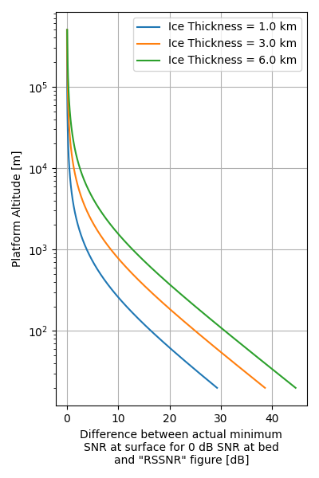

# Estimating the radar sounder link budget required to see the ice-bed interface in Antarctica and Greenland

**Context:** Ice-penetrating radar sounders are used to image through ice sheets and glaciers in order to see the internal structure and topography beneath the ice. It is our primary tool for making maps of the bedrock of Antarctica and Greenland. Due to the cost and logistical limitations of flying conventional aircraft in these remote places, there is a lot of interest in UAV (both low-altitude and stratospheric) and satellite radar sounding. This tool is meant to help assess the signal-to-noise ratio (SNR) of new radar systems. This is one of the key constraints for high altitude radar sounding, but notably not the only one. (The biggest other consideration is clutter, which is a separate issue we are not discussing here.)

## Brief background on nadir-pointing radar sounder link budgets

Two major things make estimating link budgets for nadir-pointing radar sounders different from most other radar systems: different assumptions about the relative flatness of targets and larger unknowns in target properties.

The usual radar equation derived for side-looking synthetic aperture radar systems has a dependence of 1/R^3, where R is the range between the platform and the imaged object. This derivation comes from assuming that the objects in the scene add incoherently. In contrast to this, ice-penetrating radars typically point straight down at surfaces which are relatively flat, especially compared to the larger wavelengths usually being used (almost always larger than 0.5 m and often > 3 m). As a result, the most common assumption is that returns from the 1st Fresnel zone add coherently, which results in a 1/R^2 dependence in the radar equation.

The second difference is that there are more unknowns in the link budget. The power reflection coefficient can vary from about -1 to -33 dB for completely smooth interfaces between glacial ice and plausible materials which can exist under the ice (see Table 1 in Peters et al., 2005), and the attenuation rate in ice can vary from nearly 0 dB/km to 30 dB/km or more (see MacGregor et al., 2015). With ice thicknesses up to about 3 km in Greenland and 5 km in Antarctica, these two factors combine to create very large uncertainties in how much signal will be lost beneath the ice surface.

## "Required Surface SNR" (RSSNR)

Schroeder et al., 2021 introduced the idea of using existing airborne radar data to try to do a data-driven estimate of these englacial losses in order to comment on the feasibility of various high-altitude sounder concepts, including both stratospheric and orbital platforms. The idea is to extract the returned power at the surface and the returned power at the bed from a bunch of existing airborne IPR datasets and use this to estimate what SNR a high-altitude sounder would need for the surface reflection in order to achieve some target SNR at the basal interface (the bottom of the ice).

> Schroeder, D.M., Bienert, N.L., Culberg, R., MacKie, E.J., Teisberg, T.O., Chu, W., Young, D.A., 2021. Glaciological Constraints on Link Budgets for Orbital Radar Sounding of Earth’s Ice Sheets, in: 2021 IEEE International Geoscience and Remote Sensing Symposium IGARSS. Presented at the IGARSS 2021 - 2021 IEEE International Geoscience and Remote Sensing Symposium, IEEE, Brussels, Belgium, pp. 647–650. https://doi.org/10.1109/IGARSS47720.2021.9553237

There are many variations on radar equations for IPR systems. For now, we'll stick with a fairly common choice of spherical waves with coherent summation over the 1st fresnel zone. This gives us:

$ P_\text{surface} = \frac{P_t G_t G_r \lambda^2 |\Gamma_\text{surface}|^2}{(4 \pi h)^2} $

and

$ P_\text{bed} = \frac{P_t G_t G_r \lambda^2 T_\text{surface}^2 L_\text{ice}^2 |\Gamma_\text{bed}|^2}{(4 \pi (h + d/n))^2} $

Where:
* $P_t$ is the transmit power
* $G_t$, $G_r$ are the transmit and receive antenna gains
* $\lambda$ is the wavelength
* $|\Gamma|^2$ is the power reflection coefficient for the surface or bed interface
* $T_\text{surface}$ is the one-way power loss from transmission through the surface
* $h$ is the altitude of the radar above the surface
* $d$ is the ice thickness
* $n$ is the index of refraction of ice

(If you want to explore why there are different forms of the radar equation and where each of the derivations come from, start with Haynes et al., 2018 and Haynes 2020.)

Looking at the ratio of the surface return power to the bed return power, we can split it up into two terms: a geometric spreading correction and a ratio of the surface reflection coefficient to the various englacial return losses:

$ \frac{P_\text{surface}}{P_\text{bed}} = \frac{(h+d/n)^2}{h^2}  \frac{|\Gamma_\text{surface}|^2}{T^2_\text{surface} L_\text{ice}^2 |\Gamma_\text{bed}|^2} $

Because of the geometric spreading term, this ratio depends on the altitude of the radar system. If $h \gg d$ (for high altitude systems), then the geometric spreading term is mostly irrelevant, but it does matter a lot for low altitude systems.

We choose to define "required surface SNR" as the power ratio after correcting for the geometric spreading term. In other words:

$ \text{RSSNR} = \frac{P_\text{surface}}{P_\text{bed}} \frac{h^2}{(h+d/n)^2} \approx \frac{|\Gamma_\text{surface}|^2}{T^2_\text{surface} L_\text{ice}^2 |\Gamma_\text{bed}|^2} $

(Where by the $\approx$ symbol I just mean that it's an estimate which has some assumptions baked into it.)

For a high-altitude system ($h \gg d$), the RSSNR tells us the SNR we need at the surface in order to have 0 dB SNR at the bed. If we have some target SNR on the bed (say, 10 dB), then we add that to our RSSNR to get the desired surface SNR.

This works for low-altitude systems as well, but we additionally have to correct for the geometric spreading term. The plot below shows the magnitude of this correction. As you can see, it's extremely important for systems flying at < 1 km, but it can mostly be ignored for anything above 10 km.



*At high altitudes, the additional geometric spreading within the ice can generally be neglected. At lower altitudes, it is very important to correct RSSNR values for geometric spreading.*

To reproduce this figure:
```
uv run python scripts/rssnr_geometric_spreading.py
cp outputs/explanation/rssnr_altitude.png docs/figures/rssnr_altitude.png
```

## So why do this again?

Now that we've covered what RSSNR is, why are we re-hashing this concept? There's a few things we're doing differently here:

1. Add in Greenland
2. Make the dataset fully reproducible
3. Consider cross-system parameters (using a range of radar instruments with data available through Open Polar Radar)
4. Account for the potential bias of non-detections (places where radar systems did not see the bed, potentially indicating that the RSSNR is greater than the actual system SNR)

More on all of these things later, but, in short, there's a lot of small things that are improved here. To my knowledge, nothing meaningfully conflicts with or changes the basic conclusions of previously published work.