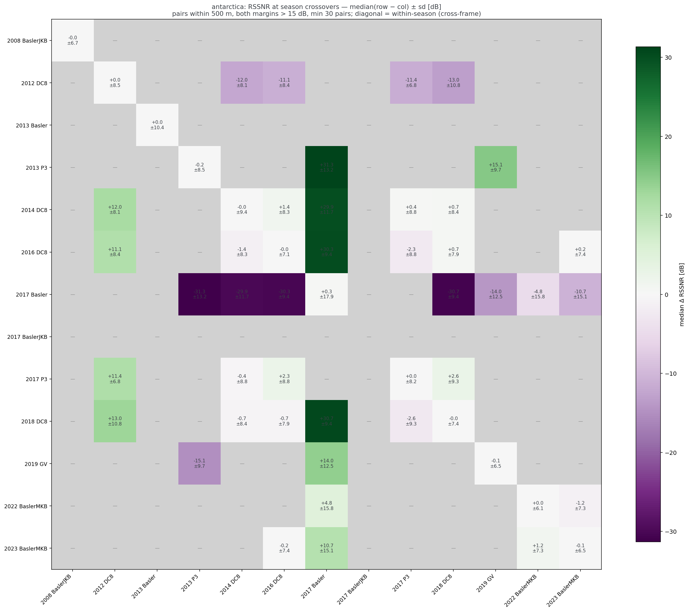
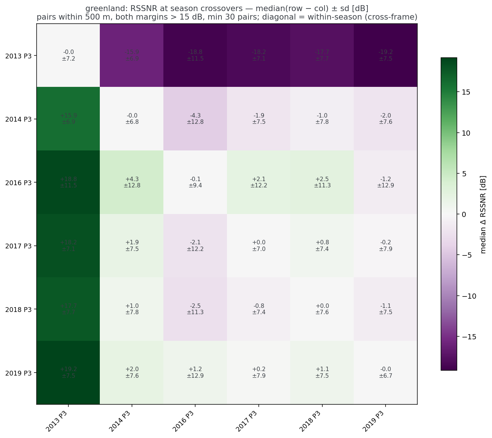
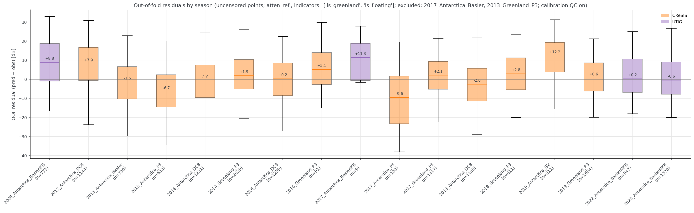
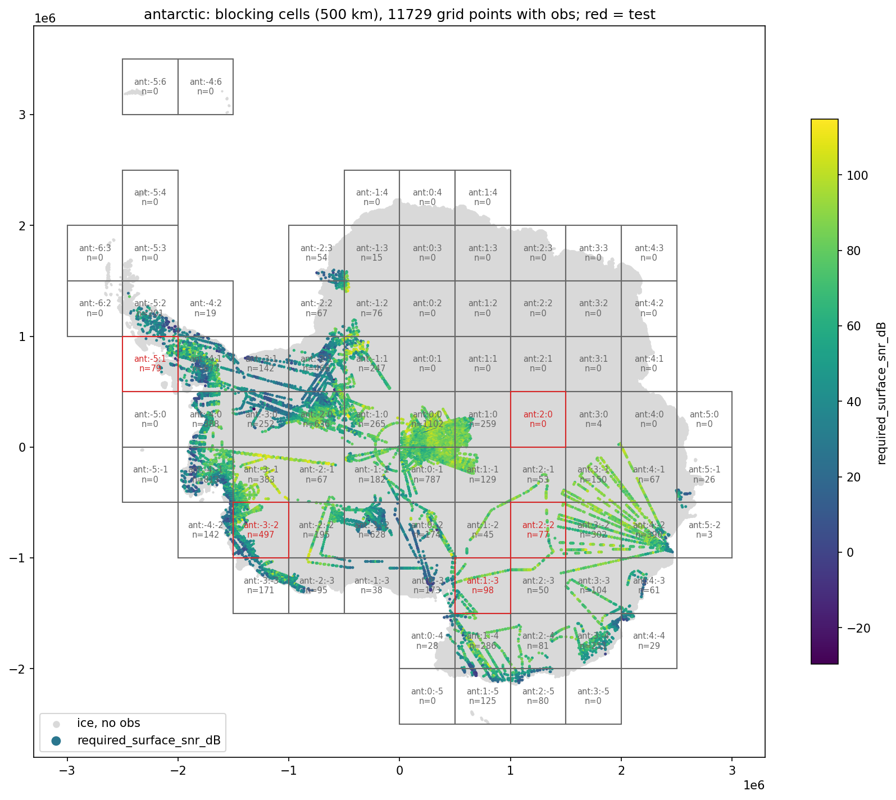
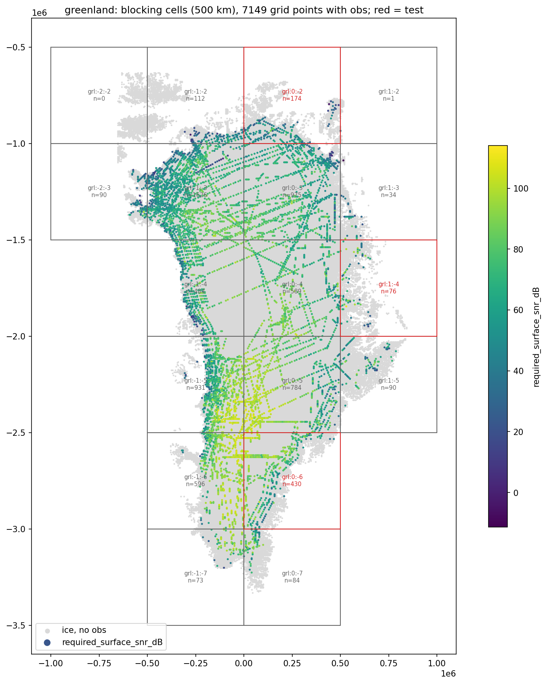

# Open Polar Radar provides a diverse set of source data

This repository is downstream of our [radar-return-statistics](https://github.com/englacial/radar-return-statistics) repository, which extracts various metrics from every available line in the [Open Polar Radar](https://openpolarradar.org/) catalog, using [xOPR](https://docs.englacial.org/xopr/).

This dataset has several advantages over past efforts:

1. It's a very large dataset, spanning more than a decade of surveying across both ice sheets and multiple institutions
2. It contains data from multiple radar sounder instruments, including significant overlaps to do cross-comparisons between them
3. All of the data is processed through the same pipeline, which reduces the chances of processing artifacts significantly biasing results

## Dataset access and augmentation

Per-trace radar metrics come from the Open Polar Radar archive via two [icechunk](https://icechunk.io/) stores, read at pinned snapshots for reproducibility. For details on accessing the datasets, see the [Data Access docs in radar-return-statistics](https://github.com/englacial/radar-return-statistics/blob/main/docs/data_access.md).

Each trace carries the RSSNR target plus noise-floor diagnostics. The augment stage joins four gridded covariates at every trace location:
* **BedMachine** thickness (v4 Antarctica / v6 Greenland)
* **ERA5** 1990–2019 mean 2 m air temperature
* **surface speed** — MEaSUREs phase-based (NSIDC-0754) for Antarctica, ITS_LIVE v2 for Greenland
* **geothermal heat flux** (Lösing & Ebbing 2021 / Colgan et al. 2022)

For details and citations of these datasets, see [Data Sources](data_sources.md).

Traces with radar-derived thickness under 100 m are dropped. (This is configured in `config/{antarctica,greenland}.yaml`.)

**Non-detections** are deliberately included. These are defined as locations where there is no bed pick available but there are bed picks both before and after in the same radar segment. This is used as a heuristic to filter out anything where bed picking simply hasn't been done.

### Radiometric calibration QC

Two instrument effects can bias RSSNR at the trace level, and since 2026-09 the upstream stores ship per-trace diagnostics for both (calibration method 0.4.0; see the [dataset changelog](https://github.com/englacial/radar-return-statistics/blob/main/docs/dataset_changelog.md)):

* **Image-combine seam steps.** The MCoRDS products stitch a low-gain image (surface) onto higher-gain images (deep ice/bed). A miscalibrated stitch puts a power step at the seam, which biases bed power relative to surface power by that step. `img_comb_offset_dB` is the residual step measured in each frame's individual images.
* **Surface saturation.** Where the surface return clips the receiver, surface power is underestimated and RSSNR is biased low. `surface_ceiling_margin_dB` is the distance below the season's fitted clip level, and `surface_source_image_index` records whether the surface sample came from the low-gain image (1) or a higher-gain image (≥2, likely saturated with a season-dependent low bias).

The split stage applies the upstream-suggested filter (`split.calibration_qc` in `config/model.yaml`) to observations and non-detections alike, before grid matching:

| rule | drops traces where | share dropped, Antarctica / Greenland |
|---|---|---|
| seam step | \|`img_comb_offset_dB`\| ≥ 3 dB | 9.1% / 8.9% |
| higher-gain surface | `surface_source_image_index` ≥ 2 | 3.1% / 3.0% |
| at the ceiling | `surface_ceiling_margin_dB` < 2 dB | 2.2% / 0.7% |
| any | | 14.4% / 12.7% |

(Shares are of the traces entering the split stage, i.e. after the season exclusions above; a trace failing several rules is counted once, in the first row it fails.)

Every rule **passes where its input is unmeasured** (NaN offset because the seam check could not run — no published images, insufficient overlap; NaN margin because no credible ceiling was fitted; unknown source image). That is the changelog's "no evidence either way" reading, and it matters: the seam check could not run on 92% of 2014_Greenland_P3 and 61% of 2012_Antarctica_DC8 at their flight geometry, so dropping unmeasured traces would remove whole seasons (35% of Antarctic and 50% of Greenland traces) rather than bad traces. The img2 rule is kept as suggested because img2-sourced traces have median RSSNR 8–17 dB below img1 traces of the same DC8 season, consistent with the documented surface-power low bias.

The filter is a trace-level cleanup, not a season-level recalibration. Retraining with it (2026-09-01, `outputs/qc_filter/`, `uv run python scripts/qc_filter_comparison.py`) lowers the atten_refl spatial-CV RMSE from 13.02 to 12.87 dB, leaves held-out test RMSE within 0.05 dB when both posteriors are scored on the same points, and shifts full-grid predictions by less than 1 dB (5th–95th percentile −0.3 to +0.6 dB). The crossover matrices above are almost unchanged by it (`scripts/season_crossover_matrix.py --calibration-qc`): within-season scatter tightens for the seam-affected seasons, but the season-to-season offsets (e.g. 2012_Antarctica_DC8 ~12 dB below the later DC8 seasons) remain, and the QC alone catches only 2% of 2013_Greenland_P3 and 46% of 2017_Antarctica_Basler — so the two season exclusions stay.


## Do the surveys agree with each other?

The full dataset represents more than a decade of data spanning multiple radar instrument generations and two different lineages (CReSIS's MCoRDS and UTIG's HiCARS/MARFA radars). Before pooling this data, it's worth asking whether they measure the same thing. Wherever these flight lines cross (defined as within 500 m here), we can look for biases between seasons.

Each cell shows the median difference in RSSNR and the standard deviation of those differences. Diagonal elements represent self-intersections. The standard deviation of these self-intersections provides some metric of the noise level within the dataset.


*Antarctic median (row − col) RSSNR at season crossovers. Gray = fewer than 30 pairs.*


*Greenland median (row − col) RSSNR at season crossovers.*

To reproduce these figures:
```
# If you haven't yet, you'll need to run the augmentation pipeline for both stores:
uv run snakemake --cores 4 --config store=antarctica
uv run snakemake --cores 4 --config store=greenland
# Then:
uv run python scripts/season_crossover_matrix.py
cp outputs/model/analysis/season_crossover_matrix_*.png docs/figures/
```

There are two notable outlier seasons: `2017_Antarctica_Basler` and `2013_Greenland_P3`. These two seasons show significant stitching artifacts that likely explain these offsets. They are excluded from further analysis for now.

> **Stitching artifacts:** Both the MCoRDS and HiCARS/MARFA systems rely on some sort of stitching across either multiple distinct waveforms or ADC channels to achieve their roughly ~100-120 dB dynamic range. If this stitching is incorrectly calibrated, it can artificially make the bed return stronger or weaker relative to the surface than it actually is. More effectively detecting and filtering this out is an ongoing area of work.

The good news is that most seasons agree with each other reasonably well, even across the two institutions.

Jumping ahead a little bit (this part depends on a model to train), another way to look at this is to compare against out-of-fold residuals. (Note that folds are spatially blocked. More on this in the next section.)


*Out-of-fold residuals by season. The box represents the inter-quartile range and the extents of the whiskers are the 2nd and 98th percentiles.*

To reproduce this figure:
```
# Requires the trained pipeline (see the Results section of the model doc).
# Re-runs the 5-fold spatially-blocked CV collecting out-of-fold predictions
# under the current config (~10 minutes):
uv run python scripts/residual_audit.py
cp outputs/model/analysis/residuals_by_season.png docs/figures/
```

Note that this figure reflects the current configuration, in which the two
outlier seasons above are already excluded and the radiometric calibration QC
is applied.

There is certainly room for improvement here (or perhaps just further calibration), but there is no obvious pattern of dramatic outlier seasons or instruments.


## Building the training set

Predictions live on a regular ~5 km grid derived from the BedMachine ice mask: 1334×1334 cells (5 km, EPSG:3031) for Antarctica and 556×310 (4.95 km, EPSG:3413) for Greenland — about 616k ice grid points (541k + 75k). Each grid point takes its nearest *attempted* radar trace within 1 km: a picked trace contributes an observed RSSNR (and its noise-floor margin), an unpicked one marks the grid point as a non-detection and contributes its detectability ceiling.

Radar observations are strongly correlated along flight lines. We use spatial blocking (Roberts et al., 2017) to mitigate the effects of spatial correlation. The input data is divided into 500 km square cells in each sheet's projected coordinates. Eight hand-picked cells are held out entirely as a test set and the remaining cells are assigned randomly to five cross-validation folds. Test cell assignments are shown below.


*Antarctic 500 km blocking cells with per-cell observation counts; red outlines are held-out test cells.*


*Same for Greenland — coverage is much denser, so nearly every cell participates.*

To reproduce these figures:
```
# The split stage draws the cell maps as a side product:
uv run snakemake --cores 4 --rerun-triggers=mtime -- outputs/model/split.parquet
cp outputs/model/cell_maps/cells_antarctic.png outputs/model/cell_maps/cells_greenland.png docs/figures/
```