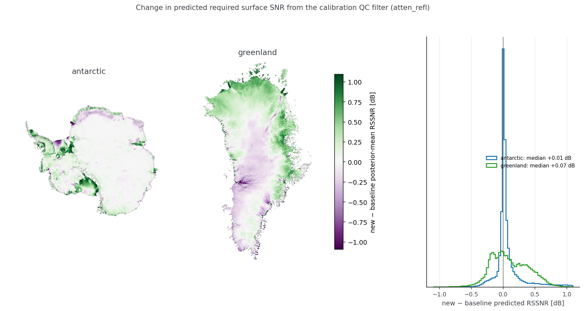

## The statistical model

We model RSSNR using a Bayesian model that reflects the basic physics in its structure. Note that this model is slightly different from Schroeder et al., 2021. In that work, we chose a fully linear model for simplicity. Here we adopt a physics-inspired model that includes (learned) attenuation rate and basal reflectivity values. We strongly caution against over-interpretation of these two values. This model is not intended to estimate attenuation rate or basal reflectivity independently from the other.

All continuous inputs and the target are converted to z-scores; the 0/1 indicators
enter un-scaled. So $\mu_i$ and $\sigma$ below are dimensionless unless stated
otherwise.

### Structure

For each grid point $i$, RSSNR is modelled as:

$$
\mu_i = a_i H_i - r_i
$$

Where $H_i$ is the ice thickness, $a_i$ can be interpreted as an attenuation rate, and $r_i$ can be interpreted as a basal reflectivity. $a_i$ and $r_i$ are modelled as linear functions of covariates $\mathbf{x}_i = [\,T_{\text{air}},\ \text{speed},\ \text{GHF}\,]_i$, indicators $g_i$ (Greenland) and $f_i$ (floating).


$$\mathbf{c}_i = \bigl[\, \mathbf{x}_i,\ g_i,\ f_i,\ g_i\mathbf{x}_i \,\bigr]$$

$$
a_i = \alpha_a + \boldsymbol{\beta}_a^{\top}\mathbf{c}_i
\qquad
r_i = \alpha_r + \boldsymbol{\beta}_r^{\top}\mathbf{c}_i
$$

Note that the $g_i\mathbf{x}_i$ term in $\mathbf{c}_i$ gives Greenland its own
covariate slopes (see [why the interaction model](interactions.md)).

Inputs are normalized from the training set. The model has the following priors in standardized space:

$$
\alpha_\bullet,\ \boldsymbol{\beta}_\bullet \sim \mathcal{N}(0,1)
$$
$$
\sigma \sim \text{HalfNormal}(1)
$$

### Observation model

The training set includes both missing picks (where the SNR may have been too low for the instrument to detect the basal peak) and borderline picks where the estimated basal power may be inaccurate. To account for this, we layer in an observation model relating $\mu_i$ to the observed RSSNR $y_i$.

Before selection, RSSNR is Gaussian about $\mu_i$:

$$y_i \sim \mathcal{N}(\mu_i,\ \sigma^2)$$

The two layers below modify that density rather than replacing it — a picked trace
contributes this density *times* the selection factor, so its distribution given a
pick is skewed, not Gaussian.

**Tobit censoring for saturated picks:** When a pick's bed power sits within
10 dB of the at-depth noise floor, the observation is only a lower bound, and its likelihood term becomes the survival function:

$$\mathcal{L}_i = \Pr(y \ge y_i) = 1 - \Phi\!\left(\frac{y_i - \mu_i}{\sigma}\right)$$

**Learned detection threshold for missing picks:** $C_i$ is the trace's
detectability ceiling — the RSSNR it would have recorded had the bed peak exactly
equalled the noise floor, and so the most demanding target that trace could still
have resolved. It is computed per trace from measurements, not fitted:

$$C_i = P^{\text{surf}}_i - P^{\text{noise}}_i
        + 20\log_{10}\!\left(\frac{r_i}{r_i + H_i/\sqrt{\varepsilon}}\right)
\qquad r_i = \tfrac{1}{2} c\, t^{\text{surf}}_i$$

with $P^{\text{surf}}$ the surface return power, $P^{\text{noise}}$ the
pick-independent at-depth noise floor, $r_i$ the range to the surface, and
$\varepsilon$ the permittivity of ice — the same geometric-spreading correction
the RSSNR definition itself uses.

A bed pick happens when the required SNR sits at least about $\theta$ dB *below*
that ceiling, which is the same as saying the bed echo clears the local noise floor
by about $\theta$ dB, with picker softness $\tau$:

$$\Pr(\text{pick} \mid y_i) = \Phi\!\left(\frac{C_i - y_i - \theta}{\tau}\right)$$

Picked points carry that factor; a missing pick contributes the closed-form
marginal over the unobserved $y$:

$$\Pr(\text{no pick}) = \Phi\!\left(\frac{\mu_i - (C_i - \theta)}{\sqrt{\tau^2 + \sigma_{\text{dB}}^2}}\right)$$

Both detection terms are evaluated in dB rather than in z-space, since $C_i$,
$\theta$ and $\tau$ are all dB quantities — hence $\mu_i$ un-normalized and
$\sigma_{\text{dB}} = \sigma\,\sigma_{\text{target}}$.

Together the layers give the likelihood over both the values and the detection
pattern,

$$\prod_{\text{picked}} p(y_i)\,\Pr(\text{pick} \mid y_i)
  \;\times\; \prod_{\text{missing}} \Pr(\text{no pick})$$

which is why no $\Pr(\text{pick})$ normalizing term appears.

A gap in bed picks is only counted as missing if the radar window at the expected bed depth is statistically indistinguishable from noise (window peak − median, $\delta < 8$ dB).
This is designed to exclude cases where clutter, not the noise floor, limits detectability.

## Fitting

The model is implemented in PyMC and fitted with NUTS with 4 chains (the cross-validation fits use 2 chains to save time; every fit is seeded).

## Results

All results may be reproduced by:

```
git clone https://github.com/englacial/radar-return-statistics-postprocessing
cd radar-return-statistics-postprocessing
uv sync

# BedMachine and the Antarctic velocity map (NSIDC-0754) are pulled from NSIDC
# with earthaccess, so NASA Earthdata credentials are required:
export EARTHDATA_USERNAME=... EARTHDATA_PASSWORD=...

# Everything: augment both stores, build grid + split, train, benchmark
uv run snakemake --cores 4 --rerun-triggers=mtime -- model_all

# Generate the plots below:
# Regional histograms with posterior-predictive overlays
uv run python scripts/region_distributions.py --model atten_refl
cp outputs/model/analysis/region_histograms_atten_refl_ppc.png docs/figures/region_histograms_ppc.png
# Prediction maps (mean + 80th percentile) and the combined obs-vs-PPC histogram
uv run python scripts/prediction_summary_figures.py
cp outputs/model/analysis/map_pred_mean.png outputs/model/analysis/map_q80.png \
   outputs/model/analysis/hist_obs_vs_ppc_sheets.png docs/figures/
# Posterior distributions in physical units (with CV/test RMSE labels)
uv run python scripts/posterior_physical.py
cp outputs/model/analysis/posterior_physical.png docs/figures/
```

The headline accuracy and calibration numbers (trained 2026-09-03 on the method-0.4.1 calibration snapshots with the radiometric calibration QC filter described in [Input data](2_input_data.md#radiometric-calibration-qc); 17,322 training grid points, 1,171 of them censored, plus 187 non-detections):

| quantity | value |
|---|---|
| CV RMSE (5-fold, spatially blocked) | 12.87 dB (fold range 11.82–14.32) |
| CV 1σ coverage | 0.68 |
| Held-out test RMSE | 12.72 dB (n = 1,330 + 88 censored) |
| Held-out test 1σ coverage | 0.71 |
| Fully-linear baseline (same layers) | CV 13.80 dB / test 13.98 dB |
| Sampler diagnostics | 0 divergences, R̂ ≤ 1.005 |

Posterior distributions of all 21 learned parameters, converted to physical units (the z-score normalization is an invertible affine transform, and the normalizer constants are stored in `posterior.nc`, so this conversion is exact). Attenuation-side parameters become two-way dB/km via σ_target/σ_thickness; reflectivity-side parameters become dB contributions to RSSNR (sign-flipped for the −refl convention); covariate effects are fully per-unit (e.g. dB/km/K, dB/km/(mW/m²)); θ, τ, and σ are natively in dB. Intercept-like values are referenced to the mean covariate conditions of the training set.


*Posteriors in physical units, with the headline CV and held-out test RMSE. The 11.6 dB/km one-way (23.2 two-way) depth-averaged attenuation rate at mean conditions falls in the physically expected range. Posterior widths are small because n ≈ 17k; the meaningful uncertainty is the 12.7 dB residual σ. The 0/1 indicators are reported as the step between their states; the interaction panels are Greenland's *offset* from the Antarctic slope, not an absolute slope.*

The distribution of observed and posterior predicted RSSNR values are shown below by ice sheet:


*Observed training data (solid) vs full-grid posterior-predictive draws (dotted) for each sheet. The predictive distributions reproduce the observed spread and location.*

Two things are notable about this plot:
1. Generally, Greenland has higher RSSNR than Antarctica, suggesting that the Greenland Ice Sheet is the harder radar target.
2. The right side tails of the observed distribution show a cutoff that we hypothesize is due to limited SNR of the instruments, not a property of the ice. The censoring approach in the model reconstructs more physically plausible longer right tails.


*The same comparison split by region, with point predictions (dashed) added.*

This effect varies by region. Regions with generally lower RSSNR (such as the Antarctic Peninsula) do not show the saturation effect and the posterior predictive distribution roughly matches the observations. Southern Greenland shows the most extreme case of the observed values saturating and the model predicting a longer tail.

The plots above show both the mean predictions and the posterior predictive distribution. The much larger spread of the posterior predictive distributions reflects the $\sigma$ noise term in the model and its estimate of a fairly large uncertainty component to the model.

Maps of the mean and 80th percentile predictions for both ice sheets are shown below:


*Posterior-mean required surface SNR on a shared color scale, coastlines from the BedMachine mask. Gaps are grid points missing a covariate or under 100 m thick.*


*The 80th percentile of the posterior predictive (recommended for instrument design). Note the different colorscale from the prior set of plots.*

### Effect of the radiometric calibration QC

The model above is the first trained after the upstream stores shipped per-trace seam-step and surface-saturation diagnostics, with the suggested filter applied (`split.calibration_qc`). The filter drops about 14% of Antarctic and 13% of Greenland traces but leaves the fit essentially unchanged: scored on the same held-out points, the pre- and post-QC posteriors differ by 0.03 dB in RMSE, every parameter stays within about two posterior standard deviations of its previous value, and the predicted maps move by less than 1 dB almost everywhere.


*Change in posterior-mean required surface SNR from adopting the calibration QC filter (new − previous model). Median +0.01 dB (Antarctica) and +0.07 dB (Greenland); 5th–95th percentile within ±0.6 dB.*

The season-level offsets visible in the crossover matrices and in the out-of-fold residuals by season are not touched by a trace-level filter and remain the largest known calibration issue. To reproduce the comparison (requires a copy of the previous `outputs/model` and augment parquets at `outputs/baseline_20260807/`):

```
uv run python scripts/qc_filter_comparison.py
cp outputs/qc_filter/prediction_difference.png docs/figures/calibration_qc_prediction_difference.png
```
