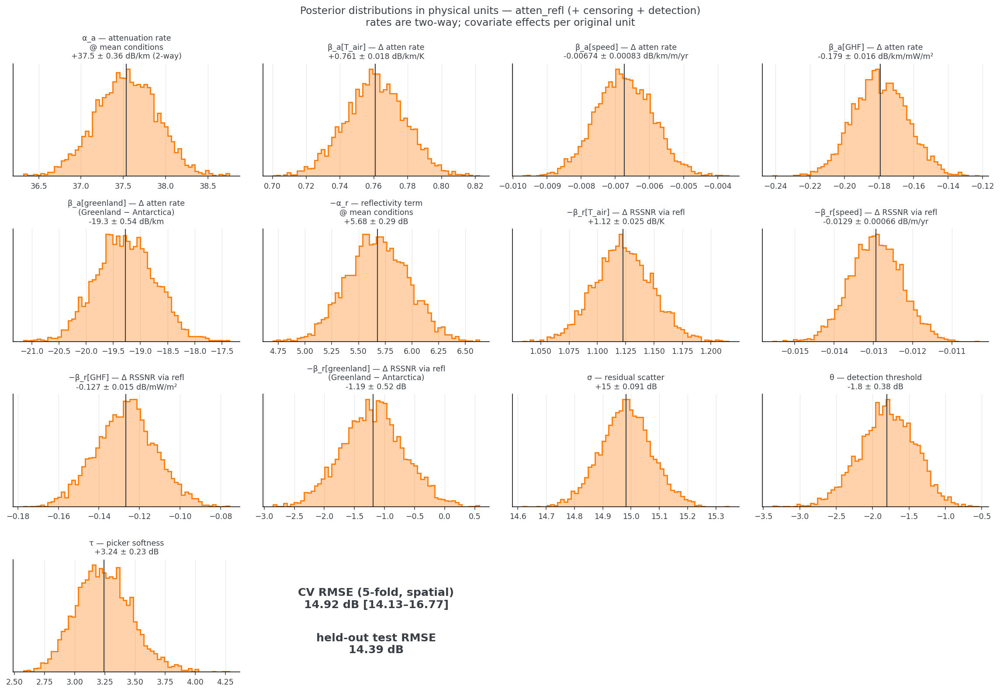
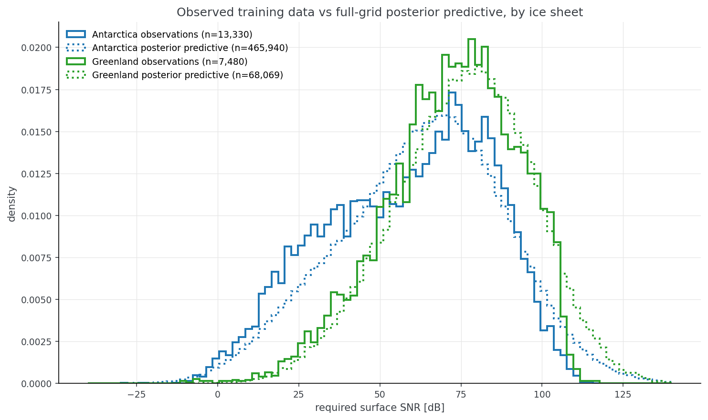
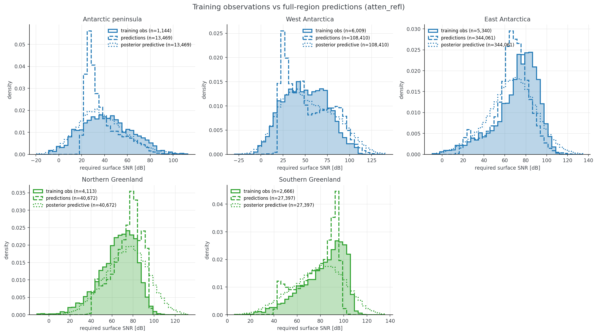
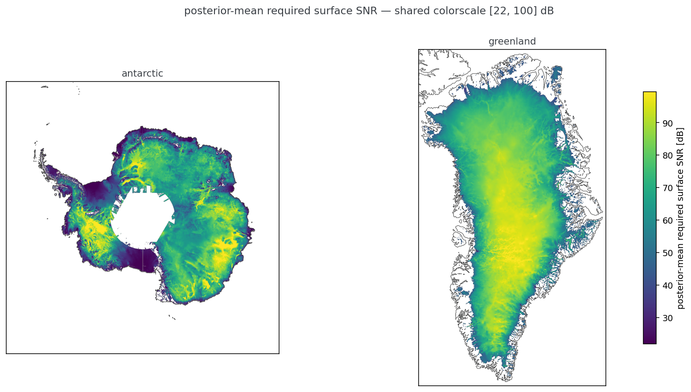
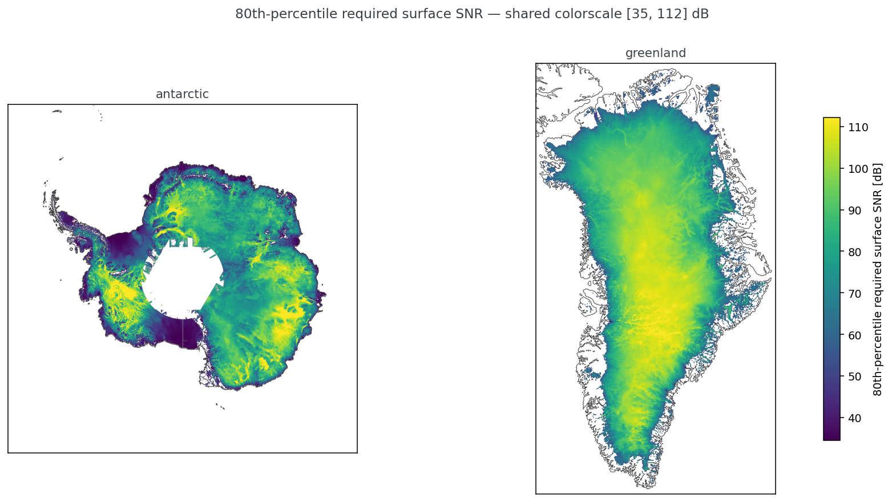

## The statistical model

We model RSSNR using a Bayesian model that reflects the basic physics in its structure. Note that this model is slightly different from Schroeder et al., 2021. In that work, we chose a fully linear model for simplicity. Here we adopt a physics-informed model that includes (learned) attenuation rate and basal reflectivity values. We strongly caution against over-interpretation of these two values. This model is not intended to estimate attenuation rate or basal reflectivity independently from the other.

All inputs are converted to z-scores.

```
RSSNR = atten_rate · thickness − refl                   (dB, normalized)

atten_rate = α_a + β_a · [T_air, speed, GHF, greenland]
refl       = α_r + β_r · [T_air, speed, GHF, greenland]

observed RSSNR ~ Normal(RSSNR*, σ)
```

Priors are Normal(0, 1) on every standardized coefficient and HalfNormal(1) on σ.

Two observation-side layers handle the missingness honestly, adding just two more parameters:

**1. Tobit censoring for saturated picks.** When a pick's bed power sits within 10 dB of the at-depth noise floor, its likelihood term becomes `P(RSSNR ≥ observed)` instead of a density — the observation is used as the lower bound it truly is.

**2. A learned detection threshold for non-detections.** A bed pick happens when the echo clears the local noise floor by about **θ** dB, give or take a picker softness **τ**:

```
P(pick | RSSNR) = Φ((C − RSSNR − θ) / τ)
```

where `C` is the trace's measured detectability ceiling (surface power, geometry, and the pick-independent at-depth noise floor). Picked points carry that selection factor; non-detections contribute the closed-form marginal `P(no pick) = Φ((μ − (C − θ)) / sqrt(τ² + σ²))` (with σ expressed in dB).

Note that a gap only counts as a non-detection if the radar window at the expected bed depth is statistically indistinguishable from noise (window peak − median, δ < 8 dB). This is intended to exclude cases where clutter, not the noise floor, limits detectability. The RSSNR model is not well-suited to determining clutter budgets, so we explicitly try to avoid estimating this case.

In total, there are 13 learned parameters, all with physically interpretable meaning. (Though we discourage over-interpretation of the model results. This is an engineering tool, not a scientific data product to determine properties of the ice sheets.)

## Fitting

The model is implemented in PyMC and fitted with NUTS with 4 chains (the cross-validation fits use 2 chains to save time; every fit is seeded).

## Results

All results may be reproduced by:

```
git clone https://github.com/englacial/radar-return-statistics-postprocessing
cd radar-return-statistics-postprocessing
uv sync

# BedMachine requires NASA Earthdata credentials:
export EARTHDATA_USERNAME=... EARTHDATA_PASSWORD=...

# Everything: augment both stores, build grid + split, train, benchmark
uv run snakemake --cores 4 --rerun-triggers=mtime -- model_all

# Generate the plots below:
# Regional histograms with posterior-predictive overlays
uv run python scripts/region_distributions.py --model atten_refl
cp outputs/model/analysis/region_histograms_atten_refl_ppc.png docs/figures/region_histograms_ppc.png
# Prediction maps (mean + 80th percentile) and the combined obs-vs-PPC histogram
uv run python scripts/prediction_summary_figures.py
cp outputs/model/analysis/map_pred_mean.png outputs/model/analysis/map_q80.png \
   outputs/model/analysis/hist_obs_vs_ppc_sheets.png docs/figures/
# Posterior distributions in physical units (with CV/test RMSE labels)
uv run python scripts/posterior_physical.py
cp outputs/model/analysis/posterior_physical.png docs/figures/
```

The headline accuracy and calibration numbers:

| quantity | value |
|---|---|
| CV RMSE (5-fold, spatially blocked) | 14.92 dB (fold range 14.13–16.77) |
| CV 1σ coverage | 0.68 |
| Held-out test RMSE | 14.39 dB (n = 1,433 + 90 censored) |
| Held-out test 1σ coverage | 0.70 |
| Fully-linear baseline (same layers) | CV 15.68 dB / test 14.56 dB |
| Sampler diagnostics | 0 divergences, R̂ ≤ 1.002 |

Posterior distributions of all 13 learned parameters, converted to physical units (the z-score normalization is an invertible affine transform, and the normalizer constants are stored in `posterior.nc`, so this conversion is exact). Attenuation-side parameters become two-way dB/km via σ_target/σ_thickness; reflectivity-side parameters become dB contributions to RSSNR (sign-flipped for the −refl convention); covariate effects are fully per-unit (e.g. dB/km/K, dB/km/(mW/m²)); θ, τ, and σ are natively in dB. Intercept-like values are referenced to the mean covariate conditions of the training set.


*Posteriors in physical units, with the headline CV and held-out test RMSE. The 18.8 dB/km one-way (37.5 two-way) depth-averaged attenuation rate at mean conditions falls in the physically expected range — a sanity check the z-scored values cannot provide. Posterior widths are small because n ≈ 21k; the meaningful uncertainty is the 15 dB residual σ, not parameter doubt.*

The distribution of observed and posterior predicted RSSNR values are shown below by ice sheet:


*Observed training data (solid) vs full-grid posterior-predictive draws (dotted) for each sheet. The predictive distributions reproduce the observed spread and location.*

Two things are notable about this plot:
1. Generally, Greenland has higher RSSNR than Antarctica, suggesting that the Greenland Ice Sheet is the harder radar target.
2. The right side tails of the observed distribution show a cutoff that we hypothesize is due to limited SNR of the instruments, not a property of the ice. The censoring approach in the model reconstructs more physically plausible longer right tails.


*The same comparison split by region, with point predictions (dashed) added.*

This effect varies by region. Regions with generally lower RSSNR (such as the Antarctic Peninsula) do not show the saturation effect and the posterior predictive distribution roughly matches the observations. Southern Greenland shows the most extreme case of the observed values saturating and the model predicting a longer tail.

The plots above show both the mean predictions and the posterior predictive distribution. The much larger spread of the posterior predictive distributions reflects the $\sigma$ noise term in the model and its estimate of a fairly large uncertainty component to the model.

Maps of the mean and 80th percentile predictions for both ice sheets are shown below:


*Posterior-mean required surface SNR on a shared color scale, coastlines from the BedMachine mask. Gaps are grid points missing a covariate (e.g. the ITS_LIVE polar hole) or under 100 m thick.*


*The 80th percentile of the posterior predictive (recommended for instrument design). Note the different colorscale from the prior set of plots.*
