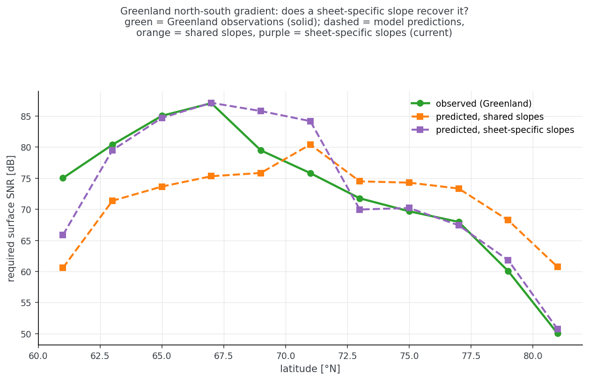

## Why Greenland gets its own covariate slopes

The model shares one set of covariate coefficients between Antarctica and Greenland, with a `is_greenland` indicator to separate them.

While the basic physics governing RSSNR should be the same across both ice sheets, this model does not capture those physics directly, and fitting a single set of coefficients across both ice sheets does not perform as well as including interaction terms between the `is_greenland` indicator and the covariates.

### Greenland north-south variation

Maps of RSSNR in Greenland show a strong north-south division, with higher RSSNR values in Southern Greenland (and an increasing number of missing bed picks). The model with a single set of coefficients across both ice sheets failed to reproduce this:

### Adding interactions

Adding `train.interactions: [is_greenland]` appends `greenland × covariate`
products to the design matrix, so each ice sheet gets its own slope on air
temperature, speed and geothermal heat flow. 
Note that `β_a[greenland] × thickness` is already the ice sheet-by-thickness interaction.

Initial performance gains from adding the interaction terms:

| | shared slopes | sheet-specific slopes |
|---|---|---|
| CV RMSE (5-fold, spatially blocked) | 14.11 dB (12.87–14.93) | **13.02 dB** (11.91–14.38) |
| Held-out test RMSE | 13.83 dB | **12.67 dB** |
| Held-out test 1σ coverage | 0.70 | **0.72** |
| Non-detection logscore | −2.55 | **−2.35** |
| Greenland RMSE, held-out | 13.89 dB | **11.95 dB** |
| Antarctic RMSE, held-out | 13.94 dB | **13.13 dB** |
| Residual σ | 14.26 dB | **12.91 dB** |

Fitted coefficients changes:

| covariate | side | Antarctica | Greenland | P(offset > 0) |
|---|---|---|---|---|
| T_air | attenuation | 0.571 | 1.732 dB/km/K | 1.000 |
| T_air | reflectivity | 0.246 | 3.455 dB/K | 1.000 |
| speed | attenuation | −0.0068 | −0.0221 dB/km/(m/yr) | 0.000 |
| speed | reflectivity | −0.0081 | −0.0282 dB/(m/yr) | 0.000 |
| GHF | attenuation | −0.077 | −0.116 dB/km/(mW/m²) | 0.22 |
| GHF | reflectivity | −0.005 | −0.140 dB/(mW/m²) | 0.000 |

Reproduce these figures with `uv run python scripts/interaction_experiment.py` (compares the
current fit against a shared-slope run in `outputs/exp_interact/`).
