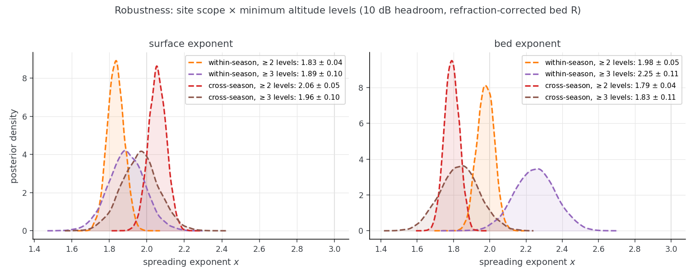

# Multi-altitude crossovers: estimating the range exponent in 1/R^x

Radar-sounding link budgets generally assume a 1/R² geometric spreading, consistent with
a coherent surface over a Fresnel zone area or an infinite plane (see Haynes et al., 
2018, Table 1, rows 5-7). This includes all of the rest of the analysis in this
respository (see `docs/1_rssnr_background.md`).

There are defensible reasons to use 1/R³ (incoherent SAR) or 1/R⁴
(point target) geometric spreading forms of the radar equation (again, see Haynes et al.,
2018). This experiment estimates the exponent empirically
from multi-altitude crossovers in airborne radar sounder data. We extract locations
where flight lines cross at substantially different altitudes, so the same ice and
geology (approximately - no correction for time-varying effects) is observed at
different ranges and the power difference isolates the range dependence.

**Result**

We apply a Bayesian model to estimate the exponent x in the relationship 1/R^x.

The table below shows inverted distributions for x, using different input filters
of which crossovers are allowed. All fits use the data screens below and Student-t
likelihood.

| channel | site scope    | min levels | n traces / sites | x           |
|---------|---------------|-----------:|-----------------:|-------------|
| surface | within-season | 2          | 3144 / 1294      | 1.83 ± 0.05 |
| surface | within-season | 3          | 673 / 229        | 1.89 ± 0.10 |
| surface | cross-season  | 2          | 5727 / 2210      | 2.05 ± 0.05 |
| surface | cross-season  | 3          | 1389 / 409       | 1.96 ± 0.10 |
| bed     | within-season | 2          | 4873 / 1888      | 1.98 ± 0.05 |
| bed     | within-season | 3          | 780 / 235        | 2.25 ± 0.11 |
| bed     | cross-season  | 2          | 15762 / 5556     | 1.79 ± 0.04 |
| bed     | cross-season  | 3          | 1874 / 483       | 1.83 ± 0.10 |

These are fit on a broad range of radar data without careful manual QC. Notably, the 
choice of how aggressively to exclude data that is potentially not radiometrically
consistent implies a larger uncertainty than the resulting output distributions.

However, all of the results (for both the surface and the bed) generally cluster around
x=2, providing strong evidence for the 1/R² geometric spreading assumed elsewhere in this
repository.

If you re-generate these results (see below), `outputs/multi_altitude_crossovers/robustness_site_selection_posteriors.png` will show a visual version of the results table
above, which should resemble this static cached image:



## Methodology

**Sites.** Traces (from the joined store parquets; upstream is 10 s-decimated,
~0.5–1.5 km spacing) are partitioned into disjoint sites: groups pairwise
within 1 km laterally containing ≥ 2 (or ≥ 3) passes whose median heights
above the surface can be greedily chained with ≥ 200 m gaps. "Within-season"
sites use only passes from one OPR collection, generally corresponding to a single
season and instrument. "Cross-season" runs mix collections.

**Ranges.** Surface: R = platform elevation − surface elevation. Bed: the
refraction-corrected R = h + d/1.78 (d = ice thickness), matching
`docs/1_rssnr_background.md` and `mission_design_tool/physics.js`.

**Bayesian model** (per channel; fit in PyMC, `exponent_bayes.py`):

$$
\begin{aligned}
P_{ij} &= \alpha_i - 10\,x\,\bigl(\log_{10} R_{ij} - \overline{\log_{10} R}_i\bigr)
    + \delta_{\text{high}}\,\mathbf{1}\bigl[R_{\text{surf},ij} \ge 3\ \text{km}\bigr]
    + \gamma_{c(ij)} + \varepsilon_{ij} \\
\varepsilon_{ij} &\sim \text{StudentT}\left(\nu = 4,\ 0,\ \sigma\right)
\end{aligned}
$$

where the $\gamma_{c(ij)}$ season-offset term is included only for
cross-season fits.

* i = site, j = pass. α_i is a per-site fixed effect absorbing englacial attenuation,
  basal reflectivity, season calibration, and other effects. Per-site
  centering of log₁₀R decorrelates α from x; the exponent is identified
  purely by between-pass contrasts within sites, pooled over all sites.
* δ_high ~ N(0, 3 dB): a free offset for the high-altitude regime
  (attenuator-accuracy insurance; posteriors come out ≈ 0–2.5 dB).
* γ_c ~ N(0, 5 dB): per-season calibration offsets, needed only when sites
  mix seasons (identified by the multi-season sites).
* Priors: x ~ N(3, 1.5); α_i ~ N(site mean power, 20); σ ~ HalfNormal(5).
* **Bed channel likelihood**: detected picks get a signal-plus-noise
  pedestal mean, softmax(μ, N_i) with sharpness ln(10)/10 fixed by physics
  (N_i = per-trace noise floor), and are left-censored at N_i
  (using `pm.Censored`) replacing a hard margin cut, whose survivor bias
  otherwise inflates the high-altitude offset.
* A synthetic-recovery check (known x on the real site geometry) runs before
  every real fit.

## Data filters

**Image combining (`img_comb_windows.py`).** CReSIS products stitch a
waveform playlist; image 2 is spliced at max(T_blank, T_comb + t_surface),
falling back to the absolute time T_end(img1) − T_guard when the surface
flies out of image 1's record gate. Beyond that point "surface power" is
image 2's (often saturated) surface response — e.g. the DC-8 low-altitude config
shows a razor-sharp ~19–30 dB cliff at 8 μs TWTT (~1.2 km AGL) and a flat
floor above. The screen requires the surface pick to live inside image 1's
valid window, computed per segment from the OPR param spreadsheets (array
worksheet `img_comb`) plus each segment's posted img_01 Time gate. Windows
vary by platform and config (P-3 ≈ 5.5–7 μs, DC-8 low ≈ 8 μs, DC-8 high
≈ 37–80 μs), so no single TWTT cut is safe.

**Saturation (`saturation_levels.py`, margin from
`saturation_margin_analysis.py`).** The ADC clip level in product units is
exact bookkeeping: S = 20·log₁₀(Vpp/2) − adc_gains_dB(wf1) per segment
(hardware attenuator error cancels, because the loader divides by the same
number). While the ADC clipping level can be identified, we don't know when the ADC
goes non-linear before this point and cannot account for LNAs or other front-end
devices going non-linear earlier.

Empirically, pairwise crossover exponents go negative when the brighter trace
is within 6 dB of S and only recover by 10–15 dB below S.
The surface channel therefore keeps only traces with
**≥ 10 dB headroom** below S (results are insensitive to widening this to
20 dB). 2012_Antarctica_DC8 has no derivable S (no gain field in the posted
products, pre-modern processing chain) and is excluded from the surface
channel. Modeling the clipping instead of screening it (softmin at S) was
tried and is retained in `exponent_bayes.py`; estimated thresholds are
degenerate with α, and with the screen in place the softmin is inert.

Full investigation history (artifact examples, validation against observed
cliffs and pile-ups, failed-model post-mortems):
`agent_notes/20260831-exponent-bayes-results.md`,
`agent_notes/20260831-dc8-gain-investigation.md`,
`agent_notes/20260831-saturation-level-derivation.md`,
`agent_notes/20260831-artifact-example-frames.md`.

## Reproducing

Prerequisite: the joined parquets `outputs/{antarctica,greenland}/*.parquet`
from the main augment pipeline. All commands from the repo root. Steps 2–3
fetch small files from GitLab/data.cresis.ku.edu (cached under
`outputs/multi_altitude_crossovers/cache_img_comb/`).

```bash
# 1. bootstrap site table (falls back to a heuristic gate; rebuilt in step 4)
uv run python scripts/multi_altitude_crossovers/build_model_table.py

# 2. per-segment surface-validity windows (image combining)
uv run scripts/multi_altitude_crossovers/img_comb_windows.py

# 3. per-segment ADC saturation levels
uv run scripts/multi_altitude_crossovers/saturation_levels.py

# 4. rebuild site tables with the exact screens (within- and cross-season)
uv run python scripts/multi_altitude_crossovers/build_model_table.py
uv run python scripts/multi_altitude_crossovers/build_model_table.py --cross-season

# 5. site-selection robustness grid -> robustness_site_selection.csv
#    + robustness_site_selection_posteriors.png
uv run python scripts/multi_altitude_crossovers/robustness_site_selection.py

# 6. site maps -> sites_map_{antarctica,greenland}.png
uv run python scripts/multi_altitude_crossovers/sites_map.py

# optional: re-derive the 10 dB headroom margin empirically
uv run python scripts/multi_altitude_crossovers/saturation_margin_analysis.py

# optional: single-fit variants and sensitivities (headroom, likelihoods, R conventions)
uv run python scripts/multi_altitude_crossovers/exponent_bayes.py
```

All outputs will be stored in `outputs/multi_altitude_crossovers/`.
